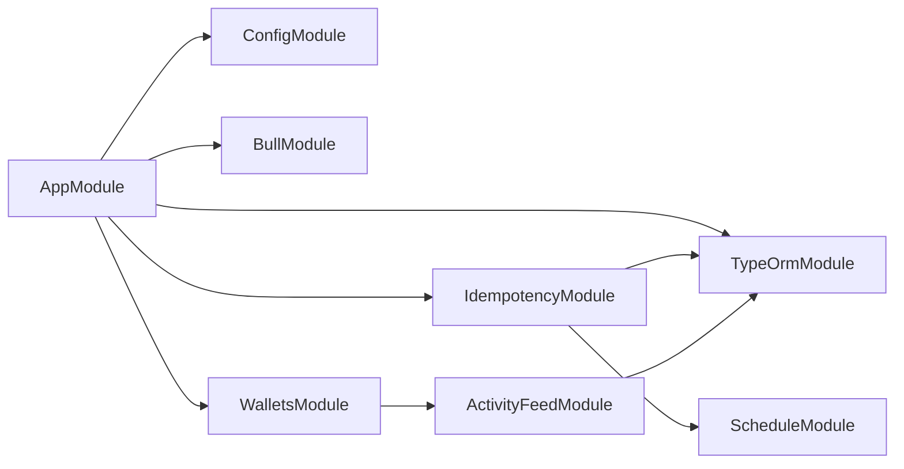
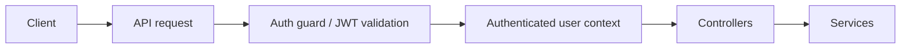
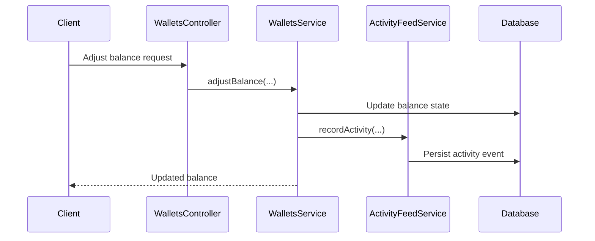

# Architecture

This repository is a NestJS application organized around a small set of focused modules:

- `ConfigModule` validates and structures runtime configuration.
- `IdempotencyModule` deduplicates replayable requests and stores cached responses.
- `WalletsModule` manages in-memory balance updates.
- `ActivityFeedModule` stores and serves audit-style activity records.

## Module dependency graph

## Authentication flow

The repository currently does not ship a full auth module, but the expected request flow is:

## Transaction lifecycle

Wallet balance changes and related activity events follow the same general lifecycle:

## Key design decisions

- **Idempotency first**: replayable requests are cached so duplicate submissions can reuse a safe response.
- **Event-driven hooks**: balance changes emit activity records so the feed stays in sync with business events.
- **Structured feed items**: the activity feed returns consistent fields (`timestamp`, `type`, `description`, `ipAddress`, `deviceInfo`, `securityEvent`) for UI rendering.
- **Configuration validation**: environment values are validated at startup to fail fast on bad deployment settings.
- **Modular boundaries**: each domain area stays in its own Nest module to keep growth manageable.
