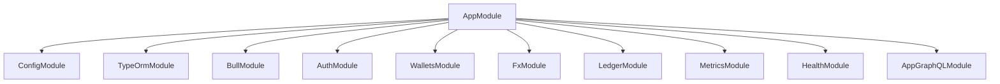
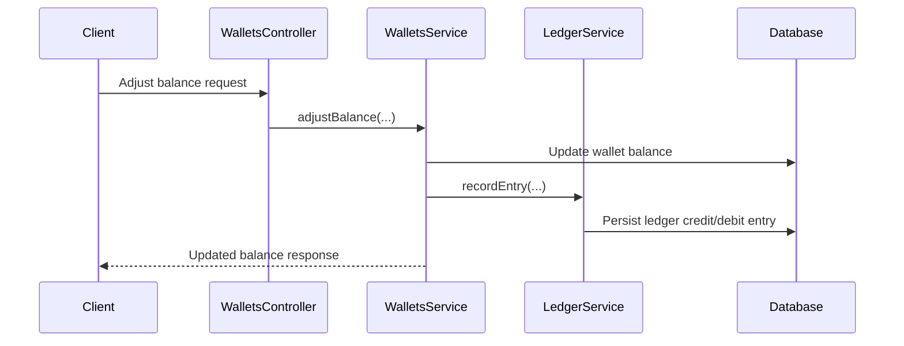

# Architecture

This repository is an enterprise NestJS financial technology platform organized into focused domain module groupings wired into `AppModule`:

- **Auth & Identity**: `AuthModule`, `UsersModule`, `SessionsModule`, `ApiKeysModule` providing global `JwtAuthGuard` JWT verification.
- **Payments, FX & Ledger**: `WalletsModule`, `FxModule`, `ExchangeRatesModule`, `LedgerModule`, `BulkPaymentsModule`, `FeeTiersModule`.
- **Compliance & Risk**: `AmlModule`, `KycModule`, `KycTiersModule`.
- **Infrastructure & Observability**: `ConfigModule`, `HealthModule`, `MetricsModule`, `QueuesModule`, `AuditModule`, `AppGraphQLModule`.

## Deferred modules

`AppModule` previously imported the module files below, none of which were ever committed to the
repository. The imports have been removed so the root module compiles; each name is recorded here as
deferred scope rather than as working functionality:

`AdminAuditModule`, `AnnouncementsModule`, `ComplianceModule`, `DataArchiveModule`,
`EnrichmentModule`, `EscrowModule`, `ExperimentsModule`, `FeatureFlagsModule`, `GoalsModule`,
`InsightsModule`, `InsightsForecastModule`, `ModulesCacheModule`, `RetryModule`, `RiskEngineModule`,
`ScheduledTransactionsModule`, `SecretsModule`, `StrategyOptimizerModule`,
`TransactionApprovalModule`, `TransactionRiskModule`, `VersioningModule`.

A further set of dangling imports duplicated modules that do exist under a different path, and were
dropped in favour of the real ones: `./modules/reconciliation` (use `ReconciliationModule` from
`src/reconciliation`), `./modules/mail` (`src/mail`), `./modules/wallets` (`src/wallet`) and
`./modules/referrals` (`src/referral`). `LedgerModule`, `KycModule` and `FxModule` were repointed at
their real locations under `src/ledger`, `src/kyc` and `src/fx`.

`npm run check:app-module-imports` (run in CI and on `prebuild`) fails the build if a relative
import in `src/app.module.ts` stops resolving to a file on disk.

## Database connection configuration

`src/database/data-source.ts` (used by the `migration:*`/`seed` CLI scripts) and
`src/config/configuration.ts` (consumed by `TypeOrmModule.forRootAsync` in `app.module.ts`) used
to derive Postgres connection settings independently, each reading raw `process.env.DB_*` with
its own inline defaults — and only `configuration.ts` computed a `DB_SSL`-derived value, which
`app.module.ts`'s TypeORM factory then didn't even pass through. Migrations/seeds could silently
run without TLS against a database the app itself connects to with TLS, or vice versa.

Both paths now call the shared `buildPostgresConnectionOptions()` in
`src/config/database-options.ts`, which reads `process.env` directly (it has to — `data-source.ts`
runs as a plain TypeORM CLI script with no Nest DI context) and returns a TypeORM-ready `ssl`
value (`false | { rejectUnauthorized: boolean }`). `app.module.ts`'s factory now passes
`database?.ssl` through instead of dropping it. Issue #1290.

## Module dependency graph

```mermaid
flowchart TD
  AppModule["AppModule"] --> ConfigModule["ConfigModule"]
  AppModule --> TypeOrmModule["TypeOrmModule"]
  AppModule --> BullModule["BullModule"]
  AppModule --> AuthModule["AuthModule"]
  AppModule --> WalletsModule["WalletsModule"]
  AppModule --> FxModule["FxModule"]
  AppModule --> LedgerModule["LedgerModule"]
  AppModule --> MetricsModule["MetricsModule"]
  AppModule --> HealthModule["HealthModule"]
  AppModule --> AppGraphQLModule["AppGraphQLModule"]
```

## Authentication flow

Authentication is handled globally by `JwtAuthGuard` registered as an `APP_GUARD`. Requests without `@Public()` decorator require a valid Bearer JWT header.

```mermaid
flowchart LR
  Client["Client"] --> Api["API request"]
  Api --> JwtGuard["JwtAuthGuard (Global APP_GUARD)"]
  JwtGuard -->|Valid Token| UserContext["Authenticated User Context (req.user)"]
  JwtGuard -->|@Public() Decorator| PublicEndpoint["Public Controller Endpoint"]
  UserContext --> Controllers["Domain Controllers / GraphQL Resolvers"]
  Controllers --> Services["Domain Services"]
```

## Transaction lifecycle

Wallet balance changes and related ledger entries follow an atomic database transaction lifecycle:

```mermaid
sequenceDiagram
  participant Client
  participant WalletsController
  participant WalletsService
  participant LedgerService
  participant Database

  Client->>WalletsController: Adjust balance request
  WalletsController->>WalletsService: adjustBalance(...)
  WalletsService->>Database: Update wallet balance
  WalletsService->>LedgerService: recordEntry(...)
  LedgerService->>Database: Persist ledger credit/debit entry
  WalletsService-->>Client: Updated balance response
```

## Key design decisions

- **Global Authentication**: `JwtAuthGuard` enforces authentication across REST and GraphQL endpoints unless explicitly decorated with `@Public()`.
- **Idempotency first**: Replayable requests are cached so duplicate submissions reuse safe cached responses.
- **Double-Entry Bookkeeping**: Money-movement flows record dual ledger entries for complete auditability.
- **Failover Exchange Rates**: Dual provider failover with stale-rate fallback guarantees FX rate availability.
- **Container Observability**: Health indicators and Prometheus metrics export application state for orchestrators.
