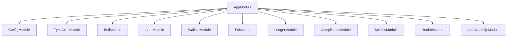
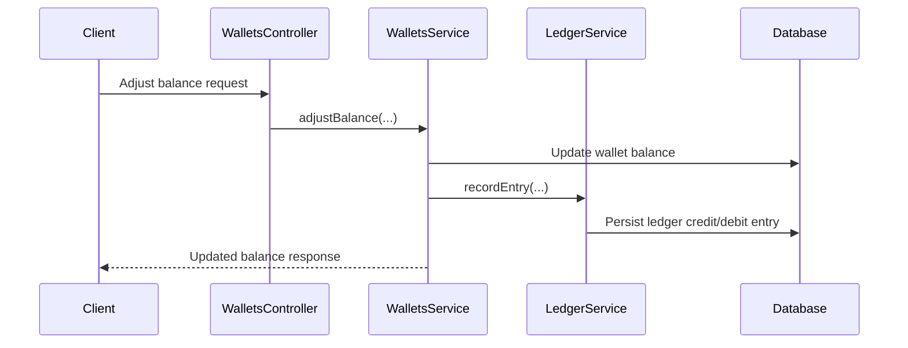

# Architecture

This repository is an enterprise NestJS financial technology platform organized into focused domain module groupings wired into `AppModule`:

- **Auth & Identity**: `AuthModule`, `UsersModule`, `SessionsModule`, `ApiKeysModule` providing global `JwtAuthGuard` JWT verification.
- **Payments, FX & Ledger**: `WalletsModule`, `FxModule`, `ExchangeRatesModule`, `LedgerModule`, `BulkPaymentsModule`, `ScheduledTransactionsModule`, `FeeTiersModule`.
- **Compliance & Risk**: `AmlModule`, `ComplianceModule`, `KycModule`, `KycTiersModule`, `RiskEngineModule`, `TransactionRiskModule`.
- **Infrastructure & Observability**: `ConfigModule`, `HealthModule`, `MetricsModule`, `QueuesModule`, `AuditModule`, `AppGraphQLModule`.

## Module dependency graph

```mermaid
flowchart TD
  AppModule["AppModule"] --> ConfigModule["ConfigModule"]
  AppModule --> TypeOrmModule["TypeOrmModule"]
  AppModule --> BullModule["BullModule"]
  AppModule --> AuthModule["AuthModule"]
  AppModule --> WalletsModule["WalletsModule"]
  AppModule --> FxModule["FxModule"]
  AppModule --> LedgerModule["LedgerModule"]
  AppModule --> ComplianceModule["ComplianceModule"]
  AppModule --> MetricsModule["MetricsModule"]
  AppModule --> HealthModule["HealthModule"]
  AppModule --> AppGraphQLModule["AppGraphQLModule"]
```

## Authentication flow

Authentication is handled globally by `JwtAuthGuard` registered as an `APP_GUARD`. Requests without `@Public()` decorator require a valid Bearer JWT header.

```mermaid
flowchart LR
  Client["Client"] --> Api["API request"]
  Api --> JwtGuard["JwtAuthGuard (Global APP_GUARD)"]
  JwtGuard -->|Valid Token| UserContext["Authenticated User Context (req.user)"]
  JwtGuard -->|@Public() Decorator| PublicEndpoint["Public Controller Endpoint"]
  UserContext --> Controllers["Domain Controllers / GraphQL Resolvers"]
  Controllers --> Services["Domain Services"]
```

## Transaction lifecycle

Wallet balance changes and related ledger entries follow an atomic database transaction lifecycle:

```mermaid
sequenceDiagram
  participant Client
  participant WalletsController
  participant WalletsService
  participant LedgerService
  participant Database

  Client->>WalletsController: Adjust balance request
  WalletsController->>WalletsService: adjustBalance(...)
  WalletsService->>Database: Update wallet balance
  WalletsService->>LedgerService: recordEntry(...)
  LedgerService->>Database: Persist ledger credit/debit entry
  WalletsService-->>Client: Updated balance response
```

## Key design decisions

- **Global Authentication**: `JwtAuthGuard` enforces authentication across REST and GraphQL endpoints unless explicitly decorated with `@Public()`.
- **Idempotency first**: Replayable requests are cached so duplicate submissions reuse safe cached responses.
- **Double-Entry Bookkeeping**: Money-movement flows record dual ledger entries for complete auditability.
- **Failover Exchange Rates**: Dual provider failover with stale-rate fallback guarantees FX rate availability.
- **Container Observability**: Health indicators and Prometheus metrics export application state for orchestrators.
