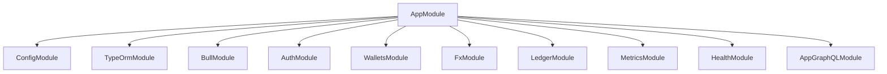
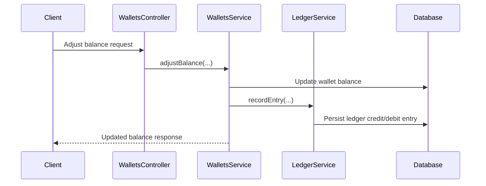

# Architecture

This repository is an enterprise NestJS financial technology platform organized into focused domain module groupings wired into `AppModule`:

- **Auth & Identity**: `AuthModule`, `UsersModule`, `SessionsModule`, `ApiKeysModule` providing global `JwtAuthGuard` JWT verification.
- **Payments, FX & Ledger**: `WalletsModule`, `FxModule`, `ExchangeRatesModule`, `LedgerModule`, `BulkPaymentsModule`, `FeeTiersModule`.
- **Compliance & Risk**: `AmlModule`, `KycModule`, `KycTiersModule`.
- **Infrastructure & Observability**: `ConfigModule`, `HealthModule`, `MetricsModule`, `QueuesModule`, `AuditModule`, `AppGraphQLModule`.

## Deferred modules

`AppModule` previously imported the module files below, none of which were ever committed to the
repository. The imports have been removed so the root module compiles; each name is recorded here as
deferred scope rather than as working functionality:

`AdminAuditModule`, `AnnouncementsModule`, `ComplianceModule`, `DataArchiveModule`,
`EnrichmentModule`, `EscrowModule`, `ExperimentsModule`, `FeatureFlagsModule`, `GoalsModule`,
`InsightsModule`, `InsightsForecastModule`, `ModulesCacheModule`, `RetryModule`, `RiskEngineModule`,
`ScheduledTransactionsModule`, `SecretsModule`, `StrategyOptimizerModule`,
`TransactionApprovalModule`, `TransactionRiskModule`, `VersioningModule`.

A further set of dangling imports duplicated modules that do exist under a different path, and were
dropped in favour of the real ones: `./modules/reconciliation` (use `ReconciliationModule` from
`src/reconciliation`), `./modules/mail` (`src/mail`), `./modules/wallets` (`src/wallet`) and
`./modules/referrals` (`src/referral`). `LedgerModule`, `KycModule` and `FxModule` were repointed at
their real locations under `src/ledger`, `src/kyc` and `src/fx`.

`npm run check:app-module-imports` (run in CI and on `prebuild`) fails the build if a relative
import in `src/app.module.ts` stops resolving to a file on disk.

## Database connection configuration

`src/database/data-source.ts` (used by the `migration:*`/`seed` CLI scripts) and
`src/config/configuration.ts` (consumed by `TypeOrmModule.forRootAsync` in `app.module.ts`) used
to derive Postgres connection settings independently, each reading raw `process.env.DB_*` with
its own inline defaults — and only `configuration.ts` computed a `DB_SSL`-derived value, which
`app.module.ts`'s TypeORM factory then didn't even pass through. Migrations/seeds could silently
run without TLS against a database the app itself connects to with TLS, or vice versa.

Both paths now call the shared `buildPostgresConnectionOptions()` in
`src/config/database-options.ts`, which reads `process.env` directly (it has to — `data-source.ts`
runs as a plain TypeORM CLI script with no Nest DI context) and returns a TypeORM-ready `ssl`
value (`false | { rejectUnauthorized: boolean }`). `app.module.ts`'s factory now passes
`database?.ssl` through instead of dropping it. Issue #1290.
## Removed dead code

- **`CurrencyPair` entity duplication** (issue #1296) — three distinct `@Entity('currency_pairs')`
  classes existed (`src/fx/currency-pair.entity.ts`, `src/fx/entities/currency-pair.entity.ts`,
  `src/currencies/entities/currency-pair.entity.ts`), all mapping the same table with different
  constraints/precision. `src/currencies/entities/currency-pair.entity.ts` was registered by
  `CurrenciesModule` via `TypeOrmModule.forFeature([CurrencyPair])`, but `CurrenciesService` never
  injected that repository — a dead registration that, alongside `FxModule`'s own registration of
  a *different* `CurrencyPair` class for the same table, was a live schema conflict with zero
  functional benefit. Removed it and its unused `UpsertCurrencyPairDto` from `src/currencies/`.
  Separately, `FxModule` registered `src/fx/currency-pair.entity.ts` while `CurrencyPairService`
  injected `src/fx/entities/currency-pair.entity.ts` — two different classes for the same table,
  breaking `CurrencyPairService`'s repository injection at runtime. Both had an identical field
  set, so `CurrencyPairService` was repointed at the module-registered entity
  (`src/fx/currency-pair.entity.ts`) and the now-unused `src/fx/entities/currency-pair.entity.ts`
  was deleted. Down from three entity classes to one; no migration was needed since no schema
  drift between the surviving entity and any migration was found in this repo.
- **`src/modules/webhooks/`** (issue #1294's duplicate webhook subsystem) — removed. Unlike the
  issue's premise, only `src/webhooks` (`WebhooksModule`, Bull-queue delivery, DNS-based SSRF
  checks) was actually imported into `app.module.ts`; `src/modules/webhooks` (synchronous axios
  delivery, no SSRF checks) was not registered anywhere and was fully unreachable dead code by the
  time this was picked up. `src/webhooks` is the canonical, live webhook subsystem.
- **`AccountDeletionService`** (`src/users/services/account-deletion.service.ts`) — removed. It
  hard-deleted referrals/rate alerts and deactivated the account with no password confirmation,
  no 2FA, and no zero-balance check — unlike the live `AccountClosureService`
  (`src/users/account-closure.service.ts`), which enforces all three. It had zero callers or
  module registrations anywhere in `src/`. Account closure/deletion should go through
  `AccountClosureService`; this weaker, unreachable duplicate was removed rather than merged, to
  avoid a future refactor accidentally wiring up the path with no safeguards.
- **`src/modules/wallets/controllers/withdrawal.controller.ts`** — removed (issue #1301's
  "stray withdrawal controller with no module file" fragment of the `src/wallet` vs.
  `src/modules/wallets` directory duplication). It had no owning `.module.ts`, so it was never
  registered/reachable, and its `JwtAuthGuard` import (`../../auth/guards/jwt-auth.guard`) didn't
  even resolve to a file on disk — it predates a guard relocation and was never updated. It
  implemented a real 24h new-beneficiary withdrawal cooldown on top of the deprecated
  `src/transactions/transactions.service.ts`'s `createWithdrawal()`, which is a genuinely useful
  safeguard the live `POST /transactions/withdrawal` route (`src/transactions/transactions.controller.ts`)
  doesn't have — but wiring an unreviewed, previously-broken money-movement endpoint live without
  being able to run the test suite against it here was judged too risky. If this cooldown is
  wanted, it should be re-added directly to the live withdrawal flow (or ported once the
  `src/transactions` vs. `src/modules/transactions` consolidation from issue #1300 lands), fixed,
  and tested before going live.
- **`NotificationQueueModule`/`NotificationProcessor`** (`src/notification/`) — removed. The
  `@Process(NOTIFICATION_JOB_NAMES.DISPATCH)` handler was fully implemented, but a repo-wide
  search found zero producers ever calling `.add(NOTIFICATION_JOB_NAMES.DISPATCH, ...)` — the
  entire push path was unreachable. Wiring it up naively would have bypassed the user
  notification-preference checks that `NotificationBatchingService` already enforces on the real
  delivery path, so rather than duplicate/bypass that logic this dead consumer, its queue
  registration, and the `NOTIFICATION_JOB_NAMES` constant were removed instead.
  `PushNotificationService`/`PushModule` (used by `NotificationBatchingService` and
  `DevicesController`) and the `notification-queue` Bull queue monitored by
  `queue-monitor.controller.ts` (registered separately in `src/queues/queues.module.ts`) are
  unrelated and were left in place.
- **`BlockchainModule`/`BlockchainService`** (`src/blockchain/`) — removed. Its entire
  implementation was Ethereum JSON-RPC (`eth_getBalance`, `eth_getTransactionReceipt`,
  `eth_blockNumber`, `0x...` address validation), inconsistent with this platform's actual
  Stellar-based architecture, and it was never injected anywhere outside its own module.
  No multi-chain/Ethereum support is currently planned; `src/blockchain/qr/stellar-qr.service.ts`
  is unrelated to this module and was left in place.
- **`BackupCodesService`** (`src/auth/2fa/backup-codes.service.ts`) — removed. It compared
  2FA recovery codes as plaintext (`storedCodes: string[]`), unlike the bcrypt/HMAC hashing
  standard used elsewhere in `src/auth` and `src/otp`, and was imported into `auth.module.ts`
  but never registered as a provider or called from any controller. Backup-code-based account
  recovery isn't an actual planned feature right now; if it's added later it should hash codes
  the same way `OtpService.hmac()` does before this was removed, not compare them raw.

## Module dependency graph

```mermaid
flowchart TD
  AppModule["AppModule"] --> ConfigModule["ConfigModule"]
  AppModule --> TypeOrmModule["TypeOrmModule"]
  AppModule --> BullModule["BullModule"]
  AppModule --> AuthModule["AuthModule"]
  AppModule --> WalletsModule["WalletsModule"]
  AppModule --> FxModule["FxModule"]
  AppModule --> LedgerModule["LedgerModule"]
  AppModule --> MetricsModule["MetricsModule"]
  AppModule --> HealthModule["HealthModule"]
  AppModule --> AppGraphQLModule["AppGraphQLModule"]
```

## Authentication flow

Authentication is handled globally by `JwtAuthGuard` registered as an `APP_GUARD`. Requests without `@Public()` decorator require a valid Bearer JWT header.

```mermaid
flowchart LR
  Client["Client"] --> Api["API request"]
  Api --> JwtGuard["JwtAuthGuard (Global APP_GUARD)"]
  JwtGuard -->|Valid Token| UserContext["Authenticated User Context (req.user)"]
  JwtGuard -->|@Public() Decorator| PublicEndpoint["Public Controller Endpoint"]
  UserContext --> Controllers["Domain Controllers / GraphQL Resolvers"]
  Controllers --> Services["Domain Services"]
```

## Transaction lifecycle

Wallet balance changes and related ledger entries follow an atomic database transaction lifecycle:

```mermaid
sequenceDiagram
  participant Client
  participant WalletsController
  participant WalletsService
  participant LedgerService
  participant Database

  Client->>WalletsController: Adjust balance request
  WalletsController->>WalletsService: adjustBalance(...)
  WalletsService->>Database: Update wallet balance
  WalletsService->>LedgerService: recordEntry(...)
  LedgerService->>Database: Persist ledger credit/debit entry
  WalletsService-->>Client: Updated balance response
```

## Key design decisions

- **Global Authentication**: `JwtAuthGuard` enforces authentication across REST and GraphQL endpoints unless explicitly decorated with `@Public()`.
- **Idempotency first**: Replayable requests are cached so duplicate submissions reuse safe cached responses.
- **Double-Entry Bookkeeping**: Money-movement flows record dual ledger entries for complete auditability.
- **Failover Exchange Rates**: Dual provider failover with stale-rate fallback guarantees FX rate availability.
- **Container Observability**: Health indicators and Prometheus metrics export application state for orchestrators.
