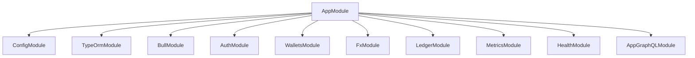
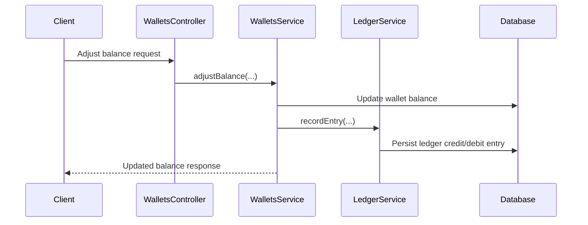

# Architecture

This repository is an enterprise NestJS financial technology platform organized into focused domain module groupings wired into `AppModule`:

- **Auth & Identity**: `AuthModule`, `UsersModule`, `SessionsModule`, `ApiKeysModule` providing global `JwtAuthGuard` JWT verification.
- **Payments, FX & Ledger**: `WalletsModule`, `FxModule`, `ExchangeRatesModule`, `LedgerModule`, `BulkPaymentsModule`, `FeeTiersModule`.
- **Compliance & Risk**: `AmlModule`, `KycModule`, `KycTiersModule`.
- **Infrastructure & Observability**: `ConfigModule`, `HealthModule`, `MetricsModule`, `QueuesModule`, `AuditModule`, `AppGraphQLModule`.

## Deferred modules

`AppModule` previously imported the module files below, none of which were ever committed to the
repository. The imports have been removed so the root module compiles; each name is recorded here as
deferred scope rather than as working functionality:

`AdminAuditModule`, `AnnouncementsModule`, `ComplianceModule`, `DataArchiveModule`,
`EnrichmentModule`, `EscrowModule`, `ExperimentsModule`, `FeatureFlagsModule`, `GoalsModule`,
`InsightsModule`, `InsightsForecastModule`, `ModulesCacheModule`, `RetryModule`, `RiskEngineModule`,
`ScheduledTransactionsModule`, `SecretsModule`, `StrategyOptimizerModule`,
`TransactionApprovalModule`, `TransactionRiskModule`, `VersioningModule`.

A further set of dangling imports duplicated modules that do exist under a different path, and were
dropped in favour of the real ones: `./modules/reconciliation` (use `ReconciliationModule` from
`src/reconciliation`), `./modules/mail` (`src/mail`), `./modules/wallets` (`src/wallet`) and
`./modules/referrals` (`src/referral`). `LedgerModule`, `KycModule` and `FxModule` were repointed at
their real locations under `src/ledger`, `src/kyc` and `src/fx`.

`npm run check:app-module-imports` (run in CI and on `prebuild`) fails the build if a relative
import in `src/app.module.ts` stops resolving to a file on disk.

## Removed dead code

- **`AccountDeletionService`** (`src/users/services/account-deletion.service.ts`) — removed. It
  hard-deleted referrals/rate alerts and deactivated the account with no password confirmation,
  no 2FA, and no zero-balance check — unlike the live `AccountClosureService`
  (`src/users/account-closure.service.ts`), which enforces all three. It had zero callers or
  module registrations anywhere in `src/`. Account closure/deletion should go through
  `AccountClosureService`; this weaker, unreachable duplicate was removed rather than merged, to
  avoid a future refactor accidentally wiring up the path with no safeguards.
- **`src/modules/wallets/controllers/withdrawal.controller.ts`** — removed (issue #1301's
  "stray withdrawal controller with no module file" fragment of the `src/wallet` vs.
  `src/modules/wallets` directory duplication). It had no owning `.module.ts`, so it was never
  registered/reachable, and its `JwtAuthGuard` import (`../../auth/guards/jwt-auth.guard`) didn't
  even resolve to a file on disk — it predates a guard relocation and was never updated. It
  implemented a real 24h new-beneficiary withdrawal cooldown on top of the deprecated
  `src/transactions/transactions.service.ts`'s `createWithdrawal()`, which is a genuinely useful
  safeguard the live `POST /transactions/withdrawal` route (`src/transactions/transactions.controller.ts`)
  doesn't have — but wiring an unreviewed, previously-broken money-movement endpoint live without
  being able to run the test suite against it here was judged too risky. If this cooldown is
  wanted, it should be re-added directly to the live withdrawal flow (or ported once the
  `src/transactions` vs. `src/modules/transactions` consolidation from issue #1300 lands), fixed,
  and tested before going live.

## Module dependency graph

```mermaid
flowchart TD
  AppModule["AppModule"] --> ConfigModule["ConfigModule"]
  AppModule --> TypeOrmModule["TypeOrmModule"]
  AppModule --> BullModule["BullModule"]
  AppModule --> AuthModule["AuthModule"]
  AppModule --> WalletsModule["WalletsModule"]
  AppModule --> FxModule["FxModule"]
  AppModule --> LedgerModule["LedgerModule"]
  AppModule --> MetricsModule["MetricsModule"]
  AppModule --> HealthModule["HealthModule"]
  AppModule --> AppGraphQLModule["AppGraphQLModule"]
```

## Authentication flow

Authentication is handled globally by `JwtAuthGuard` registered as an `APP_GUARD`. Requests without `@Public()` decorator require a valid Bearer JWT header.

```mermaid
flowchart LR
  Client["Client"] --> Api["API request"]
  Api --> JwtGuard["JwtAuthGuard (Global APP_GUARD)"]
  JwtGuard -->|Valid Token| UserContext["Authenticated User Context (req.user)"]
  JwtGuard -->|@Public() Decorator| PublicEndpoint["Public Controller Endpoint"]
  UserContext --> Controllers["Domain Controllers / GraphQL Resolvers"]
  Controllers --> Services["Domain Services"]
```

## Transaction lifecycle

Wallet balance changes and related ledger entries follow an atomic database transaction lifecycle:

```mermaid
sequenceDiagram
  participant Client
  participant WalletsController
  participant WalletsService
  participant LedgerService
  participant Database

  Client->>WalletsController: Adjust balance request
  WalletsController->>WalletsService: adjustBalance(...)
  WalletsService->>Database: Update wallet balance
  WalletsService->>LedgerService: recordEntry(...)
  LedgerService->>Database: Persist ledger credit/debit entry
  WalletsService-->>Client: Updated balance response
```

## Key design decisions

- **Global Authentication**: `JwtAuthGuard` enforces authentication across REST and GraphQL endpoints unless explicitly decorated with `@Public()`.
- **Idempotency first**: Replayable requests are cached so duplicate submissions reuse safe cached responses.
- **Double-Entry Bookkeeping**: Money-movement flows record dual ledger entries for complete auditability.
- **Failover Exchange Rates**: Dual provider failover with stale-rate fallback guarantees FX rate availability.
- **Container Observability**: Health indicators and Prometheus metrics export application state for orchestrators.
